# BÁO CÁO AUDIT HIỆN TRẠNG TRANG CHỦ (PAGE 01 — HOMEPAGE)
**Dự án:** CHUOICUNGUNG.COM  
**Route:** `/`  
**Giai đoạn:** PROMPT HOME-01 — AUDIT TRANG CHỦ HIỆN TẠI (Chưa redesign, Chưa migration, Dừng lại sau Audit)  
**Thời gian thực hiện:** 28/09/2026  

---

## 1. File & Component render route "/"
- **Entry Point & Router:** [src/App.jsx](file:///Users/heymac/Documents/hchivi/CODE/CCU/src/App.jsx) (Line 10, Line 171)
  - Cấu hình Route: `<Route path="/" element={<HomePage />} />`
- **Main Page Component:** [src/pages/HomePage.jsx](file:///Users/heymac/Documents/hchivi/CODE/CCU/src/pages/HomePage.jsx) (706 dòng code)
- **Global Layout Wrapper:** `MainLayout` trong [src/App.jsx](file:///Users/heymac/Documents/hchivi/CODE/CCU/src/App.jsx) (Lines 139–156) bao gồm:
  - Header: `<Navbar />` ([src/components/Navbar.jsx](file:///Users/heymac/Documents/hchivi/CODE/CCU/src/components/Navbar.jsx))
  - Main Body: `<main className="flex-1">{children}</main>`
  - Footer: `<Footer />` ([src/components/Footer.jsx](file:///Users/heymac/Documents/hchivi/CODE/CCU/src/components/Footer.jsx))
  - Floating Mascot: `<SuppliMascot />` ([src/components/SuppliMascot.jsx](file:///Users/heymac/Documents/hchivi/CODE/CCU/src/components/SuppliMascot.jsx))
  - Search Modal: `<SearchModal />` ([src/components/SearchModal.jsx](file:///Users/heymac/Documents/hchivi/CODE/CCU/src/components/SearchModal.jsx))

---

## 2. Khảo sát chi tiết cấu trúc & hạ tầng kỹ thuật Homepage

| Hạng mục | Hiện trạng kỹ thuật tại Homepage | Đánh giá so với Spec chuẩn |
| :--- | :--- | :--- |
| **Layout** | `MainLayout` trong `App.jsx` bọc `Navbar` sticky top, `<main>`, `Footer` và widget `SuppliMascot` góc phải. | Cần điều chỉnh logic hiển thị theo trạng thái auth và spec header/footer mới. |
| **Header** | `Navbar.jsx`: Gồm Top Micro Announcement bar (Hotline, Email, Map, Diagnostic) + Luxury Nav bar (Logo, 7 tabs nav, button Đăng nhập). | Quá tải mục direct, thiếu 3 dropdown chuẩn (`HỆ SINH THÁI`, `DỊCH VỤ`, `HỢP TÁC`) và nút CTA `[ Hỏi SUPPI & CHAINY ]`. |
| **Footer** | `Footer.jsx`: 4 cột (Logo + Intro hạ tầng, Tầm nhìn & Chiến lược, Hệ sinh thái Danh bạ, Bảo mật & DMCA) + Trống đồng Đông Sơn xoay nền. | Cần tái cấu trúc thành 5 nhóm chuẩn: `TÌM NGUỒN`, `HỆ SINH THÁI`, `CHƯƠNG TRÌNH`, `HỢP TÁC`, `HỖ TRỢ`. |
| **Navigation** | 7 Tabs desktop: Bản đồ 6 GĐ (có dropdown 6 GD & 18 Pha), Hội/Hiệp hội, Doanh nghiệp, Nhà máy, KCN, Sàn nhu cầu (HOT badge), Tuyển dụng (có dropdown). Mobile có Drawer. | Chưa có liên kết trực tiếp vào workflow AI (`/tro-ly-ai`), thừa module tuyển dụng trên header chính. |
| **Hero** | Background Canvas sóng hạt (`NetworkBackground`), Widget Expo gấp gọn bên phải, Tiêu đề font Space Grotesk gradient 6 màu, Input `ClickUpBrainSearchBar`, 3 hàng Marquee từ khóa cuộn liên tục. | **Lệch workflow cốt lõi:** Chưa có Hero Chatbox chuẩn AI (SUPPI & CHAINY prompt box, quick tags) để kích hoạt Intent Detection & tạo Requirement Draft. |
| **Search** | `ClickUpBrainSearchBar.jsx`: Dropdown chọn 4 scope (Tất cả, KCN, Nhà máy, Hiệp hội, Giai đoạn). Submit dẫn sang `/tu-khoa/:slug`, `/khu-cong-nghiep?q=...` hoặc `/san-nhu-cau`. | Tìm kiếm dạng từ khóa cổ điển (keyword matching), không chuyển message sang `/tro-ly-ai?q=...`. |
| **Existing Sections** | Gồm 8 khu vực: (1) Hero + Marquee; (2) `HomeMatchingHub` (3 CTA + 4 khối dịch vụ/sự kiện); (3) Lifecycle Poster (Wheel 3D + 5 metric cards); (4) `SupplyChainPipelineFlow`; (5) Vì sao đứng sai chỗ + `HoverTypewriterAlertBox`; (6) 6 Giai đoạn với `InteractiveExplodedFlower3D`; (7) Ranh giới "KHÔNG LÀM" & 3 Nguyên tắc; (8) Bottom CTA Banner. | Quá nhiều nội dung triết lý & diễn giải tĩnh; **thiếu hoàn toàn** các block dữ liệu sống: Card Nhu cầu đang tìm nguồn (real DB), Card NCC tiêu biểu theo năng lực, Vai trò người dùng (6 roles). |
| **Responsive Behavior** | Tailwind responsive (sm, md, lg, xl). Hỗ trợ chạm trượt (touch-scroll). Tuy nhiên, các section 3D (`perspective: '1200px'`, Three.js flower) và marquee có nguy cơ gây lag hoặc giật khung hình trên mobile cấp thấp. | Cần lược bỏ 3D nặng ở Homepage theo Spec mục 23 để đảm bảo LCP < 2.5s. |
| **Authentication State** | Chỉ có Modal Popup đăng nhập/đăng ký (`AuthModal.jsx`). Header chưa hiển thị trạng thái khi đã đăng nhập (User profile, Bell thông báo, Tên tổ chức, Dropdown công việc). | Cần bổ sung phân nhánh UI Header: Guest vs. Authenticated. |
| **API** | `HomePage.jsx` **không gọi bất kỳ API nào**. Dữ liệu lấy từ file tĩnh client-side. | Thiếu endpoint hợp nhất `GET /api/home` và `POST /api/ai/session` cho Hero. |
| **Database Query** | Không có query database trực tiếp. Backend Express (`server/routes/api.js`) có sẵn các model `Enterprise`, `Demand`, `IndustrialPark`, `Factory` nhưng chưa được Homepage khai thác. | Cần HomeService kết nối dữ liệu thật từ MongoDB / Express API. |
| **CMS / Config** | `LanguageContext` (`src/locales/vi.json`, `en.json`). Không có CMS động cho Quick Prompts, Featured items. | Cần tách config Quick Prompts, 3 lối vào, Featured Partners vào file cấu hình chuẩn. |
| **Analytics** | Hiện tại **chưa tích hợp** tracking events nào trên Homepage. | Thiếu bộ sự kiện: `home_view`, `hero_prompt_submitted`, `entry_*_clicked`, `role_selected`, v.v. |
| **SEO Metadata** | Khai báo tĩnh trong `index.html`: Title cũ, Description chung chung, OpenGraph cơ bản. H1 nằm sai chỗ (`HomeMatchingHub`), Hero dùng `<h2>`. | Thiếu H1 chuẩn duy nhất tại Hero; Title & Description chưa chuẩn theo spec. |

---

## 3. Danh sách tất cả Component Homepage đang sử dụng

1. [src/pages/HomePage.jsx](file:///Users/heymac/Documents/hchivi/CODE/CCU/src/pages/HomePage.jsx) (Trang chủ chính)
2. [src/components/NetworkBackground.jsx](file:///Users/heymac/Documents/hchivi/CODE/CCU/src/components/NetworkBackground.jsx) (Canvas mạng nơ-ron nền)
3. [src/components/SupplyChainExpoWidget.jsx](file:///Users/heymac/Documents/hchivi/CODE/CCU/src/components/SupplyChainExpoWidget.jsx) (Widget cửa sổ gập bên phải)
4. [src/components/ClickUpBrainSearchBar.jsx](file:///Users/heymac/Documents/hchivi/CODE/CCU/src/components/ClickUpBrainSearchBar.jsx) (Thanh tìm kiếm viền gradient)
5. [src/components/home/HomeMatchingHub.jsx](file:///Users/heymac/Documents/hchivi/CODE/CCU/src/components/home/HomeMatchingHub.jsx) (Cụm 4 khối kết nối & 3 lối vào)
6. [src/components/HeroLifecycleWheel.jsx](file:///Users/heymac/Documents/hchivi/CODE/CCU/src/components/HeroLifecycleWheel.jsx) (Bánh xe xoay 6 cánh hoa vòng đời)
7. [src/components/SupplyChainPipelineFlow.jsx](file:///Users/heymac/Documents/hchivi/CODE/CCU/src/components/SupplyChainPipelineFlow.jsx) (Sơ đồ luồng 3 bước Input - Xử lý - Output)
8. [src/components/InteractiveExplodedFlower3D.jsx](file:///Users/heymac/Documents/hchivi/CODE/CCU/src/components/InteractiveExplodedFlower3D.jsx) (Mô hình 3D Three.js bung cánh hoa 6 giai đoạn)
9. Inline component: `HoverTypewriterAlertBox` (Hộp thông điệp hiệu ứng máy đánh chữ khi hover)
10. Global layout components:
    - [src/components/Navbar.jsx](file:///Users/heymac/Documents/hchivi/CODE/CCU/src/components/Navbar.jsx) (Thanh điều hướng)
    - [src/components/Footer.jsx](file:///Users/heymac/Documents/hchivi/CODE/CCU/src/components/Footer.jsx) (Chân trang)
    - [src/components/SuppliMascot.jsx](file:///Users/heymac/Documents/hchivi/CODE/CCU/src/components/SuppliMascot.jsx) (Mascot Suppli góc màn hình)
    - [src/components/auth/AuthModal.jsx](file:///Users/heymac/Documents/hchivi/CODE/CCU/src/components/auth/AuthModal.jsx) (Modal xác thực đăng nhập/đăng ký)
    - [src/components/BrandLogo.jsx](file:///Users/heymac/Documents/hchivi/CODE/CCU/src/components/BrandLogo.jsx) (Logo nhận diện thương hiệu)
    - [src/components/LanguageSwitcher.jsx](file:///Users/heymac/Documents/hchivi/CODE/CCU/src/components/LanguageSwitcher.jsx) (Chuyển đổi ngôn ngữ Việt/Anh)

---

## 4. Chi tiết từng Component Homepage

| Component & File Path | Chức năng hiện tại | Data Source | Hard-coded hay DB? | Reusable? | Đề xuất (Giữ / Sửa / Bỏ) | Dependency |
| :--- | :--- | :--- | :--- | :--- | :--- | :--- |
| **HomePage.jsx** `src/pages/HomePage.jsx` | Container điều phối toàn bộ trang chủ | Trực tiếp import các sub-components & dữ liệu mock | Hard-coded các số lượng `480+`, `14.200+`, `24.000+` | Không (Page container) | **SỬA TOÀN DIỆN** (Refactor sang 13 block mục tiêu) | React Router, Lucide Icons, LanguageContext |
| **NetworkBackground.jsx** `src/components/NetworkBackground.jsx` | Hiệu ứng Canvas hạt nơ-ron kết nối tương tác chuột | Canvas HTML5 thuần | Thuần hiệu ứng mỹ thuật | Có | **GIỮ / TINH GỌN** (Giữ làm nền Hero nhưng giảm tải CPU trên mobile) | HTML5 Canvas API |
| **SupplyChainExpoWidget.jsx** `src/components/SupplyChainExpoWidget.jsx` | Banner trượt bên phải thông báo Ngày hội chuỗi cung ứng | `src/data/expoEventsData.js` | Dữ liệu tĩnh file JS | Có | **SỬA / DI CHUYỂN** (Đưa vào Block 09 Chương trình thay vì thả nổi cạnh màn hình làm che khuất) | Lucide Icons, React Router |
| **ClickUpBrainSearchBar.jsx** `src/components/ClickUpBrainSearchBar.jsx` | Ô search dạng bộ lọc từ khóa danh bạ | State nội bộ component | Hard-coded danh mục scope | Có | **THAY THẾ** bằng Hero AI Chat Entry Box (Gửi query sang `/tro-ly-ai`) | Lucide Icons, CSS Animation |
| **HomeMatchingHub.jsx** `src/components/home/HomeMatchingHub.jsx` | 3 CTA lối vào + 4 khối: Sự kiện, Dịch vụ, Hình thức tham gia, Đối tác đồng hành | `expoEventsData.js`, array `confirmedPartners` nội bộ | Hard-coded partners, mock event | Có thể tách nhỏ | **TÁCH & SỬA**: Tách thành Block 03 (3 Lối vào), Block 09 (Chương trình), Block 10 (Dịch vụ), Block 11 (Hợp tác) | Lucide Icons, expoEventsData |
| **HeroLifecycleWheel.jsx** `src/components/HeroLifecycleWheel.jsx` | Bánh xe 6 cánh hoa đại diện 6 giai đoạn quay theo scroll | `src/data/mockData.js` (`stagesData`) | Hard-coded dữ liệu giai đoạn | Có | **TÁCH SANG** Block 06 (Bản đồ 6 giai đoạn) | Lucide Icons, stagesData |
| **SupplyChainPipelineFlow.jsx** `src/components/SupplyChainPipelineFlow.jsx` | Minh họa 3 bước: Inputs → Trung tâm điều phối → Outputs | Dữ liệu tĩnh trong component | Hard-coded 100% | Có | **BỎ HOẶC ĐƯA VÀO VỀ CHÚNG TÔI**: Homepage mới tập trung vào giải quyết nhu cầu thực tế | Lucide Icons |
| **HoverTypewriterAlertBox** `HomePage.jsx` (inline) | Hộp text cảnh báo có hiệu ứng gõ máy chữ khi hover | String nội bộ trong component | Hard-coded | Có | **BỎ HOẶC CHUYỂN ĐỔI** thành câu chốt SUPPI & CHAINY (Block 04) | Lucide Icons, LanguageContext |
| **InteractiveExplodedFlower3D.jsx** `src/components/InteractiveExplodedFlower3D.jsx` | Mô hình 3D tương tác bung 6 cánh hoa sản xuất | Three.js WebGL canvas | Hard-coded vector & mesh | Có | **BỎ KHỎI TRANG CHỦ** (Chuyển sang trang riêng `/ban-do-6-giai-doan` để tối ưu tải trang mobile & LCP) | Three.js, Canvas |
| **Navbar.jsx** `src/components/Navbar.jsx` | Thanh header điều hướng toàn site | `mockData.js`, `LanguageContext` | Hard-coded 7 tabs | Dùng toàn site | **SỬA**: Rút gọn các menu trực tiếp, thêm 3 Dropdown chuẩn, thêm CTA "Hỏi SUPPI & CHAINY" | Lucide Icons, AuthModal, LanguageSwitcher |
| **Footer.jsx** `src/components/Footer.jsx` | Chân trang toàn site | `LanguageContext` | Hard-coded link & claims | Dùng toàn site | **SỬA**: Tái cấu trúc thành 5 cột chuẩn theo spec, loại bỏ số liệu claim chưa kiểm chứng | Lucide Icons, BrandLogo |
| **SuppliMascot.jsx** `src/components/SuppliMascot.jsx` | Chibi mascot theo dõi con trỏ chuột ở góc dưới | Component `page-mascot` | Asset ảnh nội bộ | Dùng toàn site | **GIỮ & ĐỒNG BỘ**: Kết nối với trigger mở `/tro-ly-ai` hoặc chatbox | `page-mascot` |

---

## 5. Kiểm tra các CTA hiện tại của Homepage đang dẫn đi đâu

| Vị trí CTA trên Homepage | Nhãn CTA hiển thị | Đích đến hiện tại (`href` / `to`) | Phân tích tính hợp lệ so với Luồng chuẩn |
| :--- | :--- | :--- | :--- |
| **Top Micro Bar** | Trắc nghiệm định vị 18 Pha | `/dinh-vi-doanh-nghiep` | Hợp lệ (Công cụ tiện ích) |
| **Top Micro Bar** | Bản đồ KCN & Hạ tầng | `/ban-do-viet-nam` | Hợp lệ (GIS Map) |
| **Top Micro Bar** | Đăng nhu cầu tìm nhà cung ứng | `/dang-nhu-cau` | Hợp lệ, nhưng cần bổ sung lối vào `/tro-ly-ai` |
| **Hero Search Submit** | Nút kính lúp Tìm kiếm | `/tu-khoa/:slug` hoặc `/khu-cong-nghiep` | **Lệch workflow:** Cần chuyển query sang `/tro-ly-ai?q=...` |
| **Hero Marquee Tags** | 30+ Thẻ tag ngành hàng | `/tu-khoa/:slug` | Cần dẫn sang `/tro-ly-ai?q=...` hoặc filter danh mục |
| **HomeMatchingHub CTA 1** | Tôi cần tìm nhà cung ứng | `/dang-nhu-cau` | Cần dẫn sang `/tro-ly-ai?role=factory&intent=sourcing` |
| **HomeMatchingHub CTA 2** | Tôi muốn giới thiệu năng lực | `/tao-ho-so` | Hợp lệ (`/tao-ho-so` -> `AuthPage`) |
| **HomeMatchingHub CTA 3** | Tôi muốn tổ chức kết nối | `/dich-vu/to-chuc-ket-noi` | Hợp lệ |
| **Block Chương trình** | Xem tất cả chương trình | `/chuong-trinh` | Hợp lệ |
| **Block Chương trình** | Xem chương trình (Card) | `/ngay-hoi-chuoi-cung-ung/:id` | Hợp lệ (Route chi tiết sự kiện) |
| **Block Dịch vụ 1** | Xem chi tiết dịch vụ | `/dich-vu/to-chuc-ket-noi` | Hợp lệ |
| **Block Dịch vụ 2** | Vật phẩm sự kiện | `/dich-vu/vat-pham-su-kien` | Hợp lệ |
| **Block Dịch vụ 3** | Truyền thông doanh nghiệp | `/dich-vu/truyen-thong-doanh-nghiep` | Hiện dẫn sang `/founding-partner` (Cần chỉnh lại) |
| **Block Hình thức** | Tìm hiểu hình thức tham gia | Mở Modal `packageModal` | Hợp lệ (Nội bộ UI) |
| **Block Đồng hành** | Gửi đề xuất đồng hành | Mở Modal `partnerModal` | Hợp lệ (Nội bộ UI) |
| **Lifecycle Poster** | Xem Bản đồ 6 Giai đoạn | `/ban-do-6-giai-doan` | Hợp lệ |
| **Lifecycle Poster** | Trắc nghiệm định vị 18 Pha | `/dinh-vi-doanh-nghiep` | Hợp lệ |
| **Bottom CTA Banner** | Tôi đang ở giai đoạn nào → | `/dinh-vi-doanh-nghiep` | Cần chuyển thành CTA kép chuẩn: "Hỏi SUPPI & CHAINY" và "Giới thiệu năng lực" |
| **Bottom CTA Banner** | Xem Bản đồ 6 Giai đoạn → | `/ban-do-6-giai-doan` | Chuyển thành link phụ |

---

## 6. Kiểm tra các Route mục tiêu trong hệ thống

| Route mục tiêu | Trạng thái hiện tại | Component xử lý tương ứng | Ghi chú & Đánh giá |
| :--- | :--- | :--- | :--- |
| `/` | **ĐÃ CÓ** | `HomePage.jsx` | Route trang chủ chính |
| `/tro-ly-ai` | **ĐÃ CÓ** | `AiWorkspacePage.jsx` | Workspace AI tích hợp SUPPI & CHAINY, xử lý `?q=` |
| `/dang-nhu-cau` | **ĐÃ CÓ** | `PostDemandPage.jsx` | Form đăng nhu cầu B2B |
| `/tao-ho-so` | **ĐÃ CÓ** | `AuthPage.jsx` | Đăng ký & thiết lập hồ sơ tổ chức |
| `/doanh-nghiep` | **ĐÃ CÓ** | `EnterprisesPage.jsx` | Danh bạ năng lực nhà cung ứng |
| `/san-nhu-cau` | **ĐÃ CÓ** | `DemandsPage.jsx` | Sàn hiển thị nhu cầu mua sắm công khai |
| `/ban-do-6-giai-doan` | **ĐÃ CÓ** | `SixStagesMapPage.jsx` | Bản đồ tương tác 6 Giai đoạn & 18 Pha |
| `/chuong-trinh` | **ĐÃ CÓ** | `SupplyChainExpoPage.jsx` | Hub sự kiện & ngày hội chuỗi cung ứng |
| `/dich-vu` | **CHƯA CÓ TRANG CHUNG** | Chỉ có sub-routes: `/dich-vu/to-chuc-ket-noi`, `/dich-vu/vat-pham-su-kien` | **Thiếu trang Hub tổng quan `/dich-vu`** |
| `/founding-partner` | **ĐÃ CÓ** | `FoundingPartnerPage.jsx` | Trang Đối tác Đồng hành Sáng lập |
| `/hop-tac` | **CHƯA CÓ TRANG RIÊNG** | Đang phân tán qua `/founding-partner` và modal | **Thiếu route `/hop-tac` riêng theo spec** |

---

## 7. Kiểm tra Database Entities hiện có (MongoDB / Mock Data)

| Entity mục tiêu | Trạng thái kỹ thuật trong hệ thống | File cấu hình / Model liên quan | Khả năng đáp ứng Homepage |
| :--- | :--- | :--- | :--- |
| `categories` | Đã có file cấu hình chuẩn | `src/data/industryCategories69Pages.json`, `categoriesAlphabetical.json` | Đầy đủ 69 danh mục ngành chuẩn |
| `stages` | Đã có taxonomy & metadata | `src/data/mockData.js` (`stagesData`), `phaseTaxonomyAlphabetical.json` | Đầy đủ 6 giai đoạn & 18 pha kỹ thuật |
| `requirements` | Đã có Schema Mongoose & mock file | `server/models/Demand.js`, `src/data/demandsMapData.json` | Sẵn sàng schema, cần query đúng status `approved`/`ACTIVE` |
| `organizations` | Đã có Model Mongoose & JSON lớn | `server/models/Enterprise.js`, `Factory.js`, `IndustrialPark.js`, `enterprisesFull.json` (32.000+ NCC), `factoriesFull.json` (14.237+ Nhà máy), `industrialParksFull.json` (480 KCN) | Rất đầy đủ dữ liệu thô, cần lọc profile active |
| `supplier_capabilities` | Tích hợp trong Enterprise profile | Cột `phases`, `stages`, `tags`, `products` trong `enterprisesFull.json` | Chưa tách bảng độc lập, đang nằm trong Enterprise |
| `programs` | Đã có file cấu hình JS | `src/data/programsData.js`, `src/data/expoEventsData.js` | Có đầy đủ trường ngày, địa điểm, trạng thái mở đăng ký |
| `services` | Dữ liệu tĩnh trong component | Hardcoded trong `HomeMatchingHub.jsx` | Chưa có schema database hoặc JSON độc lập |
| `partners` | Dữ liệu tĩnh trong component & file | `HomeMatchingHub.jsx` (`confirmedPartners`), `src/data/strategicFoundingPartners.js` | Cần chuẩn hóa thành cấu trúc dữ liệu chung |
| `founding_partnerships`| Đã có file cấu hình JSON | `src/data/foundingPartners.json`, `strategicFoundingPartners.js` | Đầy đủ logo, thương hiệu, cam kết |

*Ghi chú:* Tuân thủ nghiêm ngặt chỉ thị: **Không tạo bảng mới hay migration ở bước này.**

---

## 8. Các số liệu Hard-code & Claim chưa kiểm chứng trên Homepage

1. **HomePage.jsx (Lines 27–29):**
   - `kcnCountFormatted = "480+"` (Hard-coded string)
   - `factoriesCountFormatted = "14.200+"` (Hard-coded string)
   - `suppliersCountFormatted = "24.000+"` (Hard-coded string)
2. **HomePage.jsx Metrics Bar (Lines 345–376):**
   - Đang hiển thị cố định: `6` Giai đoạn, `18` Pha, `480+` KCN, `14.200+` Nhà máy, `24.000+` Nhà cung ứng.
3. **Footer.jsx (Line 39):**
   - Text tuyên ngôn: *"Khép kín hệ sinh thái 480+ Khu công nghiệp, 14.237+ Nhà máy FDI và 32.000+ Nhà cung ứng qua 6 Giai đoạn & 18 Pha kỹ thuật."*
4. **Navbar.jsx (Lines 245, 263):**
   - Badge tĩnh: `4.320+ Việc Tìm Người`, `1.850+ Người Tìm Việc`.
5. **HomeMatchingHub.jsx (Line 408):**
   - *"tiếp cận cộng đồng 480+ KCN và 14.000+ nhà máy FDI."*

**Đánh giá:** Theo tiêu chí nghiệm thu của Spec (Mục 8 & Mục 25), Homepage không được tự ý đưa ra các claim, fake badge hoặc số liệu hard-code nếu database chưa có hoặc chưa chạy query đếm thực tế. Các số này cần được đếm động từ database hoặc config cấu hình rõ ràng.

---

## 9. Kiểm tra SEO hiện tại

- **Title Tag:**
  - *Hiện tại:* `<title>CHUỖICUNGỨNG.com | Nơi nguồn cung gặp đúng cơ hội</title>` (trong `index.html`)
  - *Yêu cầu Spec (Mục 20):* `<title>Chuỗi Cung Ứng | Tìm Nhà Cung Ứng & Kết Nối Nhu Cầu B2B</title>`
- **Meta Description:**
  - *Hiện tại:* `Nơi Hội / Hiệp Hội / Tổ Chức Kết Nối Kinh Doanh – Nhà Cung Ứng – Nhà Máy - KCN được đặt đúng vai trò, đúng giai đoạn, đúng thời điểm.`
  - *Yêu cầu Spec (Mục 20):* `CHUOICUNGUNG.COM hỗ trợ doanh nghiệp làm rõ nhu cầu, tìm nhà cung ứng theo năng lực và địa bàn, kết nối và theo dõi công việc đến kết quả.`
- **Canonical URL:**
  - *Hiện tại:* `<link rel="canonical" href="https://chuoicungung.com/" />` (Đạt chuẩn)
- **Heading 1 (H1):**
  - *Hiện tại:* `HomePage.jsx` chỉ có `<h2>` ở Hero; `HomeMatchingHub.jsx` có `<h1>` là *"Kết nối nhu cầu nhà máy với nhà cung ứng phù hợp"*.
  - *Yêu cầu Spec (Mục 20):* Duy nhất 1 thẻ `<h1>` trên toàn trang nằm ở Hero Block: **"BẠN ĐANG CẦN GÌ CHO DOANH NGHIỆP?"**.
- **Open Graph / Social Crawlers:**
  - Đã có `og:type`, `og:url`, `og:image`, `og:title`, `og:description`. Cần cập nhật content đồng bộ với Title/Description mới.
- **Structured Data (Schema.org):**
  - Đã có `WebSite` và `Organization`.
  - *Còn thiếu:* Khai báo `SearchAction` (kết nối tìm kiếm/hỏi đáp với trợ lý).

---

## 10. Kiểm tra Responsive & Trải nghiệm Mobile

- **Header Mobile:** Đang có Hamburger menu trượt ra Drawer dài. Chưa có layout icon tối ưu theo spec: `[Logo] [SUPPI/CHAINY icon] [☰]`.
- **Hero Mobile:** Input search đang dùng `ClickUpBrainSearchBar` co giãn tốt, nhưng các hàng marquee cuộn liên tục có thể chiếm diện tích vuốt chạm của người dùng mobile.
- **Hiệu năng & Tài nguyên (Mục 23):**
  - Mô hình 3D `InteractiveExplodedFlower3D` sử dụng Three.js WebGL rendering trực tiếp trên DOM Homepage, làm nóng máy điện thoại và tăng nguy cơ giật lag (INP & LCP cao).
  - Khối 3D card perspective (`perspective: 1200px`, `perspective: 1600px`) dễ gây lỗi tràn ngang (horizontal overflow) trên một số trình duyệt WebKit / iOS Safari nếu padding không được kiểm soát chặt chẽ.
  - Cần sticky nhẹ nút CTA "Hỏi SUPPI & CHAINY" trên mobile mà không che nội dung.

---

## 11. BẢNG TỔNG HỢP PHÂN LOẠI (MANDATORY TABLES)

### BẢNG 1: CURRENT (Hiện trạng)
| Thành phần hiện tại | Vị trí / File | Bản chất / Cách hoạt động |
| :--- | :--- | :--- |
| **Top Micro Bar** | `Navbar.jsx` | Thanh thông báo màu xanh navy trên cùng, chứa hotline & 4 link nhỏ |
| **Main Header Nav** | `Navbar.jsx` | Logo + 7 tabs nav ngang + nút Đăng nhập kích hoạt Modal |
| **Hero Neural Background** | `NetworkBackground.jsx` | Hiệu ứng canvas vẽ mạng nơ-ron tương tác chuột |
| **Hero Search Bar** | `ClickUpBrainSearchBar.jsx` | Thanh tìm kiếm kiểu ClickUp Brain với gradient viền chạy |
| **Hero Marquee Keywords** | `HomePage.jsx` | 3 hàng thẻ tag cuộn ngang tự động edge-to-edge |
| **Side Expo Widget** | `SupplyChainExpoWidget.jsx` | Widget trượt gấp mép phải thông báo sự kiện Expo |
| **HomeMatchingHub** | `HomeMatchingHub.jsx` | 3 nút CTA lối vào + 4 khối sự kiện/dịch vụ/gói tham gia/đối tác |
| **Lifecycle Wheel Section** | `HeroLifecycleWheel.jsx` + metrics | Bánh xe 6 cánh hoa xoay + 5 thẻ số liệu cố định |
| **Supply Chain Pipeline** | `SupplyChainPipelineFlow.jsx` | Sơ đồ 3 cột mô tả quy trình Input - CCU Hub - Output |
| **Vì sao đứng sai chỗ** | `HomePage.jsx` | 3 card diễn giải thực trạng + `HoverTypewriterAlertBox` |
| **Interactive 3D Flower** | `InteractiveExplodedFlower3D.jsx` | Canvas Three.js hiển thị bung hoa 6 giai đoạn |
| **Ranh giới "KHÔNG LÀM"** | `HomePage.jsx` | Khối ranh giới vận hành + 3 nguyên tắc nền tảng |
| **Bottom CTA Banner** | `HomePage.jsx` | Khối banner chân trang với 2 nút xem bản đồ & trắc nghiệm |
| **Global Footer** | `Footer.jsx` | 4 cột liên kết + hình trống đồng Đông Sơn quay chậm |

### BẢNG 2: KEEP (Giữ lại & Tái sử dụng)
| Thành phần giữ lại | Lý do giữ lại | Kế hoạch sử dụng trong cấu trúc mới |
| :--- | :--- | :--- |
| **NetworkBackground.jsx** | Thẩm mỹ công nghệ cao, nhận diện đặc trưng | Giữ làm lớp nền vi tế cho Block 01 (Hero AI Entry), tinh giản hạt trên mobile |
| **BrandLogo.jsx** | Nhận diện thương hiệu cốt lõi | Sử dụng tại Header (Block 01) và Footer (Block 13) |
| **Mascot Suppli & Chainy** | Tài sản nhận diện linh vật trợ lý AI | Nâng cấp từ widget trang trí thành trung tâm của Block 04 (Hai trợ lý - Một quy trình) |
| **Logics lọc sự kiện `openEvents`** | Tự động ẩn chương trình hết hạn | Tái sử dụng nguyên vẹn trong Block 09 (Chương trình dành cho doanh nghiệp) |
| **Khối 3 Dịch vụ kết nối cơ bản** | Nội dung nghiệp vụ rõ ràng, thiết thực | Tái sử dụng làm hạt nhân cho Block 10 (Dịch vụ hỗ trợ kết nối) |
| **Form Modal Đề xuất hợp tác & Nhận tin** | Đã hoàn thiện UX form | Tái sử dụng cho Block 10 & 11 khi người dùng gửi thông tin |
| **AuthModal.jsx** | Cơ chế xác thực B2B đầy đủ | Tiếp tục dùng cho Header khi người dùng bấm "Đăng nhập" |

### BẢNG 3: MODIFY (Chỉnh sửa & Cải tiến)
| Thành phần cần sửa | Nội dung chỉnh sửa cụ thể | Mục tiêu đạt được |
| :--- | :--- | :--- |
| **Header (`Navbar.jsx`)** | Rút bớt 7 tab trực tiếp; tạo 3 dropdown (`HỆ SINH THÁI`, `DỊCH VỤ`, `HỢP TÁC`); thêm nút CTA `[ Hỏi SUPPI & CHAINY ]`; cập nhật mobile header `[Logo] [SUPPI/CHAINY] [☰]`. | Chuẩn hóa điểm vào hệ thống, không làm ngợp giao diện |
| **Hero Section** | Thay thanh tìm kiếm tĩnh bằng Ô nhập nhu cầu tự nhiên lớn (Placeholder ví dụ cụ thể) + nút `HỎI SUPPI & CHAINY →` + 5 Quick Prompts; gán H1 duy nhất. | Đưa người dùng vào luồng `homepage → /tro-ly-ai?q=... → Requirement Draft` |
| **3 Lối vào** | Điều chỉnh lại wording theo spec: "Tôi đang cần nguồn cung", "Tôi muốn tìm khách hàng", "Tôi muốn tổ chức kết nối" với target URL tương ứng. | Định hướng ngay lập tức 3 nhóm user trọng tâm |
| **Bản đồ 6 Giai đoạn** | Tinh gọn thành 6 card chuẩn hóa (01 Chuẩn bị đến 06 Chuyển đổi), click dẫn vào `/giai-doan/:slug`, hiển thị số liệu dynamic nếu có thật. | Trực quan, dễ hiểu, không phụ thuộc WebGL 3D nặng |
| **Khối Chương trình** | Đảm bảo hiển thị danh sách từ `programs` thật; nếu không có thì hiện fallback "Chưa có chương trình phù hợp? Đăng ký nhận tin". | Tránh để block trống hoặc dùng card fake |
| **Khối Hợp tác** | Chỉ hiển thị các tổ chức đã xác nhận quyền quan hệ; có nút "Đề xuất hợp tác →" dẫn về `/hop-tac`. | Minh bạch, chuẩn mực B2B |
| **Chân trang (`Footer.jsx`)** | Chia lại thành 5 nhóm chuẩn (`TÌM NGUỒN`, `HỆ SINH THÁI`, `CHƯƠNG TRÌNH`, `HỢP TÁC`, `HỖ TRỢ`). Bỏ các claim cố định `32.000+ NCC`. | Cấu trúc phân tầng chuyên nghiệp, chuẩn SEO |
| **Bottom CTA Banner** | Chuyển thành Block 12 (Final CTA) với thông điệp: "MỘT NHU CẦU THẬT · MỘT KẾT NỐI ĐÚNG · MỘT KẾT QUẢ CÓ THỂ THEO DÕI" + 2 nút CTA. | Chốt hạ hành động cuối trang |

### BẢNG 4: REMOVE (Loại bỏ khỏi Homepage)
| Thành phần loại bỏ | Lý do loại bỏ khỏi Homepage | Nơi lưu chuyển / Phương án thay thế |
| :--- | :--- | :--- |
| **InteractiveExplodedFlower3D.jsx** | Quá nặng, tiêu hao tài nguyên CPU/GPU, cản trở chỉ số LCP & CLS trên mobile | Di chuyển hoàn toàn sang trang chuyên sâu [src/pages/SixStagesMapPage.jsx](file:///Users/heymac/Documents/hchivi/CODE/CCU/src/pages/SixStagesMapPage.jsx) |
| **SupplyChainPipelineFlow.jsx** | Mang tính hàn lâm lý thuyết, chiếm nhiều diện tích cuộn của trang chủ | Đưa vào trang Giới thiệu / Hệ sinh thái (`/he-sinh-thai`) |
| **Hộp gõ máy chữ `HoverTypewriterAlertBox`** | Hiệu ứng phụ, không mang giá trị chuyển đổi nghiệp vụ B2B | Lược bỏ, thay bằng câu chốt 3 bước của SUPPI & CHAINY |
| **Các số liệu claim hard-code** (`480+`, `14.200+`, `24.000+`) | Vi phạm quy tắc dữ liệu thật, không có bảo chứng động từ DB | Thay bằng bộ đếm dynamic qua API hoặc ẩn đi khi chưa có count thực tế |
| **Widget gập nổi `SupplyChainExpoWidget`** | Che khuất nội dung bên phải màn hình desktop, dễ gây bấm nhầm | Tích hợp trực tiếp vào Block 09 (Chương trình) |

### BẢNG 5: MISSING (Các khối & chức năng còn thiếu theo Spec)
| Khối / Tính năng thiếu | Mô tả theo Spec | Mức độ ưu tiên |
| :--- | :--- | :--- |
| **Block 04: SUPPI & CHAINY** | Khối so sánh 2 trợ lý với thông điệp: SUPPI tìm đúng nguồn, CHAINY kết nối & theo việc đến cùng | **P0** |
| **Block 05: Chọn vai trò** | 6 thẻ phân loại đối tượng: Nhà máy, Nhà cung ứng, Hội/Hiệp hội, KCN, Nhà tài trợ, Đối tác Đồng hành | **P0** |
| **Block 07: Nhu cầu đang tìm nguồn** | Danh sách các Demand Cards đang active từ database thật (che số điện thoại, email buyer, chỉ hiện tóm tắt) | **P0** |
| **Block 08: Khám phá NCC theo năng lực** | Supplier Cards hiển thị năng lực cốt lõi, địa bàn, ngày cập nhật hồ sơ (chỉ hiện NCC đã duyệt publish) | **P0** |
| **Endpoint `POST /api/ai/session`** | API nhận query từ Hero, tạo AI session và trả về redirect URL sang `/tro-ly-ai?session=...` | **P0** |
| **Endpoint tổng hợp `GET /api/home`** | API trả về dữ liệu tổng hợp sạch cho các block trang chủ | **P1** |
| **Trang Hub `/dich-vu` & Route `/hop-tac`** | Các trang đích cho CTA Dịch vụ & Hợp tác | **P1** |
| **Analytics Event Tracker** | Bộ theo dõi hành vi: `hero_prompt_submitted`, `entry_*_clicked`, `role_selected`... | **P1** |

### BẢNG 6: RISK (Các rủi ro kỹ thuật & nghiệp vụ cần lưu ý)
| Rủi ro | Mô tả chi tiết | Phương án xử lý |
| :--- | :--- | :--- |
| **Rủi ro rò rỉ dữ liệu Buyer** | Khối nhu cầu (Block 07) nếu render sai có thể làm lộ email, số điện thoại, giá mục tiêu của bên mua | Backend chỉ trả về `DemandSummaryDTO` (che thông tin liên hệ cá nhân) |
| **Rủi ro mất Query khi redirect** | Khách nhập nhu cầu tại Hero, bấm nút bị mất text khi sang `/tro-ly-ai` hoặc bị chặn bởi form đăng nhập | Session ID hoặc query params truyền an toàn qua URL, không bắt buộc login |
| **Rủi ro hiệu năng Mobile** | Sử dụng nhiều ảnh chưa tối ưu hoặc animation phức tạp gây tụt FPS và CLS cao | Dùng WebP/AVIF, lazy loading, bỏ 3D nặng, layout ổn định |
| **Rủi ro Duplicate Data** | Tạo các bảng riêng như `homepage_programs`, `homepage_cards` làm dữ liệu không đồng nhất | Đọc trực tiếp từ module gốc: `requirements`, `programs`, `organizations` |
| **Rủi ro lạm dụng danh xưng** | Gắn nhãn "Đã xác minh" (Verified) hoặc logo đối tác khi chưa có quan hệ thật | Chỉ render badge khi cờ `is_verified = true` trong database |

---

## 12. Đề xuất Bản đồ Mapping từ Homepage hiện tại sang 13 Block mục tiêu

```mermaid
flowchart TD
    subgraph Current [Hiện trạng Trang chủ]
        C_Nav[Navbar 7 Tabs]
        C_Hero[Hero + ClickUpBrain Search + 3 Marquee Rows]
        C_Hub[HomeMatchingHub: 3 CTA + 4 Khối gộp]
        C_Poster[Lifecycle Poster Wheel + 5 Metrics tĩnh]
        C_Pipe[SupplyChainPipelineFlow]
        C_Why[Vì sao đứng sai chỗ + Alert Typewriter]
        C_3D[InteractiveExplodedFlower3D]
        C_Prin[Ranh giới & 3 Nguyên tắc]
        C_CTA[Bottom CTA Banner]
        C_Foot[Footer 4 Cột + Trống đồng]
    end

    subgraph Target [13 Block Chuẩn Hóa Mục Tiêu]
        T01[01 Header: Gọn gàng + 3 Dropdowns + CTA Hỏi SUPPI]
        T02[02 Hero AI Entry: H1 + Ô nhập nhu cầu tự nhiên + Quick Prompts]
        T03[03 Ba Lối Vào: Cần Nguồn Cung / Tìm Khách Hàng / Tổ Chức Kết Nối]
        T04[04 SUPPI & CHAINY: Hai Trợ Lý - Một Quy Trình]
        T05[05 Chọn Vai Trò: 6 Cards Nhà máy, NCC, KCN, Hiệp hội...]
        T06[06 Bản Đồ 6 Giai Đoạn: 6 Thẻ tinh gọn click vào giai-doan/slug]
        T07[07 Nhu Cầu Đang Tìm Nguồn: Data thật, bảo mật buyer]
        T08[08 Nhà Cung Ứng Theo Năng Lực: Cards NCC publishable]
        T09[09 Chương Trình: Ngày hội & Phiên gặp gỡ từ programs DB]
        T10[10 Dịch Vụ: 4 Dịch vụ chính + 2 Dịch vụ phụ]
        T11[11 Hợp Tác: Xây dựng hệ sinh thái, đối tác xác nhận]
        T12[12 Final CTA: Một nhu cầu thật - Một kết nối đúng]
        T13[13 Footer: 5 Nhóm phân tầng chuẩn B2B]
    end

    C_Nav -->|Tái cấu trúc dropdown & CTA| T01
    C_Hero -->|Thay thế Search Bar thành AI Prompt Box| T02
    C_Hub -->|Tách 3 nút CTA| T03
    C_Why -->|Chuyển đổi thông điệp| T04
    C_Hub -->|Bổ sung phân luồng vai trò| T05
    C_Poster -->|Lược bỏ 3D, giữ lại cấu trúc 6 giai đoạn| T06
    Current -.->|Bổ sung mới từ DB requirements| T07
    Current -.->|Bổ sung mới từ DB organizations| T08
    C_Hub -->|Tách khối sự kiện tự động ẩn khi hết hạn| T09
    C_Hub -->|Tách khối dịch vụ| T10
    C_Hub -->|Tách khối đối tác xác thực| T11
    C_CTA -->|Thay đổi thông điệp & 2 CTA chuẩn| T12
    C_Foot -->|Phân lại 5 cột, bỏ số liệu ảo| T13
```

### Bảng chi tiết chuyển đổi từng Block:

| Block mục tiêu | Nguồn dữ liệu kế thừa từ hiện trạng | Hướng xử lý ở các bước tiếp theo |
| :--- | :--- | :--- |
| **01 Header** | `Navbar.jsx`, `BrandLogo.jsx`, `AuthModal.jsx` | Tối ưu navigation, thêm 3 dropdown, nút `[ Hỏi SUPPI & CHAINY ]`, phân biệt trạng thái login. |
| **02 Hero AI Entry** | `NetworkBackground.jsx`, `HomePage.jsx` (Hero container) | Đổi tiêu đề H1: "BẠN ĐANG CẦN GÌ CHO DOANH NGHIỆP?", input nhu cầu đa năng, nút `HỎI SUPPI & CHAINY →`, 5 quick prompt tags. |
| **03 Ba lối vào** | `HomeMatchingHub.jsx` (3 CTA buttons) | Giữ nguyên logic, chuẩn hóa URL: `/tro-ly-ai?role=factory&intent=sourcing`, `/tao-ho-so`, `/dich-vu/to-chuc-ket-noi`. |
| **04 SUPPI & CHAINY** | Xây mới dựa trên nhận diện Suppli & Chainy | Thiết kế thẻ so sánh 2 vai trò: SUPPI (Tìm nguồn) vs. CHAINY (Kết nối & theo dõi tiến độ). |
| **05 Chọn vai trò** | Xây mới | 6 thẻ vai trò điều hướng vào đúng tham số role của `/tro-ly-ai`. |
| **06 Bản đồ 6 giai đoạn** | `stagesData` trong `src/data/mockData.js` | 6 thẻ giai đoạn sạch sẽ, điều hướng `/giai-doan/:slug`, không dùng đếm số giả. |
| **07 Nhu cầu đang tìm nguồn** | `server/models/Demand.js` & `demandsMapData.json` | Render danh sách nhu cầu thực tế, ẩn dữ liệu nhạy cảm của Buyer. |
| **08 Nhà cung ứng** | `server/models/Enterprise.js` & `enterprisesFull.json` | Render thẻ nhà cung ứng theo năng lực cốt lõi & địa bàn, không tự nhận "Top 10". |
| **09 Chương trình** | Khối 1 trong `HomeMatchingHub.jsx` + `expoEventsData.js` | Hiển thị các sự kiện còn hạn đăng ký; có fallback thân thiện khi chưa có sự kiện. |
| **10 Dịch vụ** | Khối 2 trong `HomeMatchingHub.jsx` | 4 card dịch vụ chính (Tìm nguồn, Tổ chức kết nối, Hồ sơ & truyền thông, Vật phẩm sự kiện) + 2 dịch vụ phụ. |
| **11 Hợp tác** | Khối 4 trong `HomeMatchingHub.jsx` | Danh sách đối tác KCN, Hiệp hội, Nhà tài trợ đã được xác thực quan hệ chính thức. |
| **12 Final CTA** | Bottom CTA banner trong `HomePage.jsx` | Banner phong cách tối giản, 2 nút chuyển đổi trọng tâm: "HỎI SUPPI & CHAINY" và "GIỚI THIỆU NĂNG LỰC". |
| **13 Footer** | `Footer.jsx` | Cấu trúc lại 5 nhóm liên kết, bổ sung quy chế B2B và bản sắc chuỗi cung ứng. |

---

## 13. KẾT LUẬN & DỪNG LẠI SAU AUDIT (STOP AFTER AUDIT)
Theo đúng chỉ đạo của tài liệu spec `1.txt`:
- Toàn bộ audit hiện trạng, cấu trúc tệp tin, dữ liệu, dependencies, SEO và rủi ro đã được hoàn thành đầy đủ và lưu tại:
  `docs/pages/home/HOME_CURRENT_AUDIT.md`
- **Không thực hiện redesign, không migration, không xóa component, không can thiệp database, không tạo mock data ảo.**
- Hệ thống sẵn sàng cho prompt tiếp theo: **HOME-02 — Database + Backend Mapping**.
